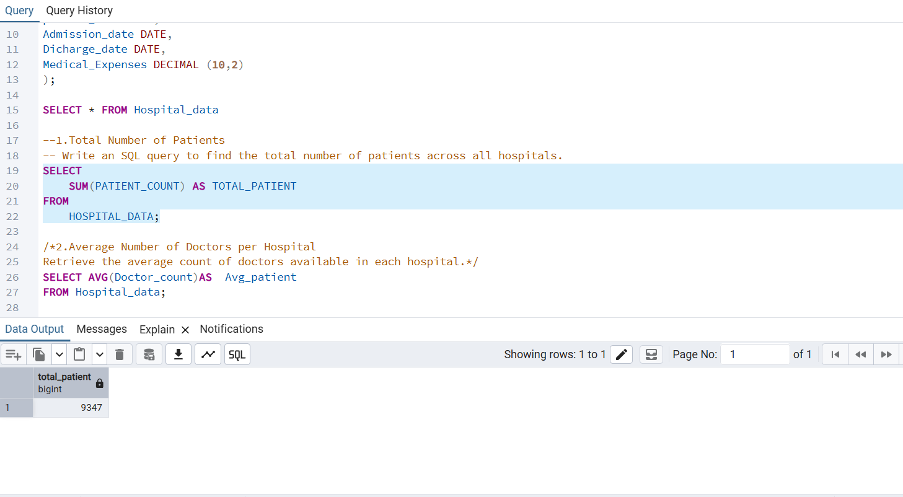
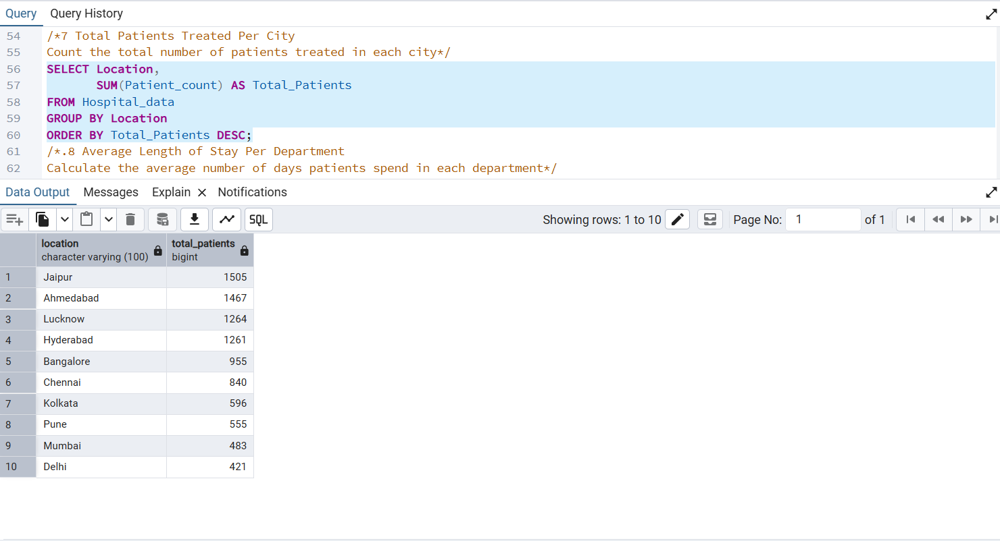
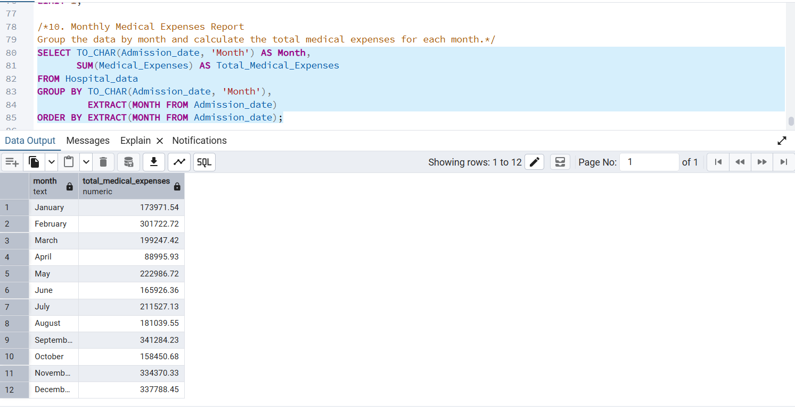
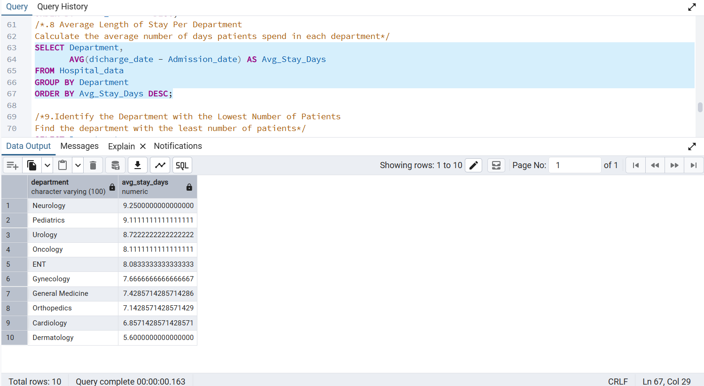

# 🏥 Hospital Data Analysis using PostgreSQL

## 📌 Project Overview
This project demonstrates SQL-based hospital data analysis using PostgreSQL and pgAdmin.

## 🛠 Technologies Used
- PostgreSQL
- pgAdmin 4
- SQL

## 📊 Analysis Performed
- Total Number of Patients
- Total Medical Expenses
- Average Medical Expenses
- Patients by City
- Department-wise Analysis
- Average Length of Stay
- Highest Patient Count
- Lowest Patient Count Department
- Monthly Medical Expenses Report

## 📂 Files
- HOSPITAL DATA PROJECT.sql
- Hospital_Data.csv
- README.md

## 🚀 SQL Concepts Used
- SELECT
- WHERE
- GROUP BY
- ORDER BY
- SUM()
- AVG()
- MIN()
- MAX()
- COUNT()
- EXTRACT()
- TO_CHAR()

## 📷 Project Screenshots

### 1. Total Patients

### 2. City Report

### 3. Monthly Medical Expenses

### 4. Department Report

## 👨‍💻 Author
**Pawan Karve**
